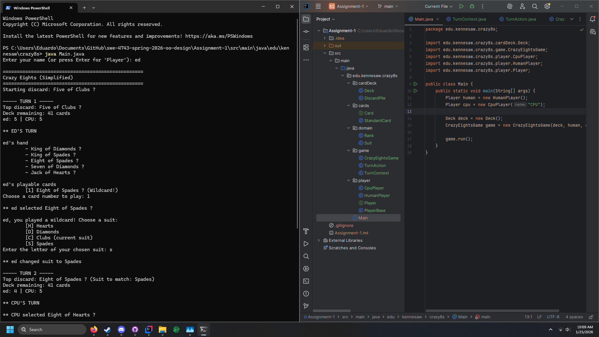

## 1. Project Description
This assignment was created to explore the concepts of interfaces, abstract classes, concrete classes, polymorphism, dynamic
dispatch, and encapsulation.  
The game this program was based off of is Crazy 8's, where players alternate turns either drawing or playing a card that matches 
the current card's suit or rank. Players can also play an 8 of any suit as a wildcard and choose any suit to be the current one 
in play. This continues until one player runs out of cards, at which point they are deemed the winner, or until there are no more 
cards to draw from, which results in a tie.  
Interfaces for the cards and players classes were used to ensure that these separate classes and their children had common features 
that can be used by higher classes even after abstraction. An abstract class was the step between the player interface and its 
concrete classes that set up common helper methods that did not fit in the interface, but still had a role amongst concrete 
implementations. This is also where polymorphism and dynamic dispatch come into play where the program treats both real-human players
and CPU's as objects that implement the player interface. This is so each concrete implementation of players can utilized properly 
according to their own unique design all without guessing if their features exist or not, as well as using the same method names and 
using common features. Encapsulation is demonstrated through the packages used for each branch of the project, with the main root of 
the project package being edu.kennesaw.crazy8s. The differen branches of encapsulation for this program include cardDeck, cards, 
domain, game, and player as their own isolated bubbles.
## 2. How to Run the Application (Console)
1.) Clone the Assignment-1 fold from this repository. 
2.) Change directory of console application to `Assignment-1\src\main\java\edu\kennesaw\crazy8s`. 
3.) Run `java Main.java`.
## 3. Screenshot

