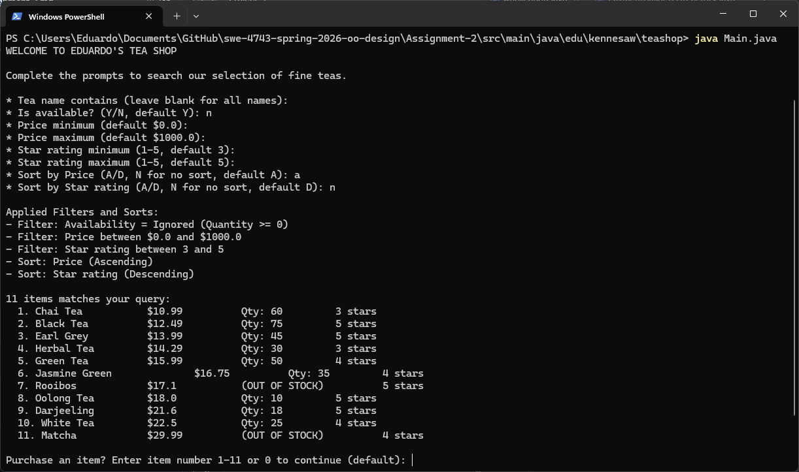

# Tea Shop Application
## Description
This Tea Shop application is text-based and uses text input to filter out and sort the tea that can be ordered from here.
Output is displayed as text in whatever medium is being used to run the application. The shop gives users the option to 
filter out what tea they want using provided filters or stick to using default options. After all filtering inputs have 
been handled, users are given the option to sort their query with some provided options. Based on the outputted query, 
users can choose which in stock item they would like to purchase, the quantity to be purchased, and their choice of payment.
  
The overall structure of this project is organized in such a way that responsibilities are divided by classes and grouped 
by namespace, thus fulfilling the Single Responsibility Principle (SRP). SRP is enriched by the use of the Strategy pattern 
in the program's payment handling, which allows new payment methods to be added without needing to modify the logic behind 
how payments are processed. The Open Closed Principle (OCP) is also practiced within this project as shown in the item 
querying implementation where the Decorator pattern has been applied such that decorators provide unique filters and 
sorting methods.
## CLI Execution Instructions
Ensure you have Java version 25 or higher installed first.  
1.) Clone the Assignment-2 from repository. 
2.) Change directory to `Assignment-2\src\main\java\edu\kennesaw\crazy8s`. 
3.) Run `java Main.java`.
### Docker
In order to run the application through Docker, make sure it is installed and setup. Then, perform the following: 
#### 1.) Build the Docker Image  
`docker build -t teashop-java`  
#### 2.) Run the Docker Container  
Run with `-it` flag so you can interact with the app:  
`docker run -it --rm teashop-java`  
## Screenshot

